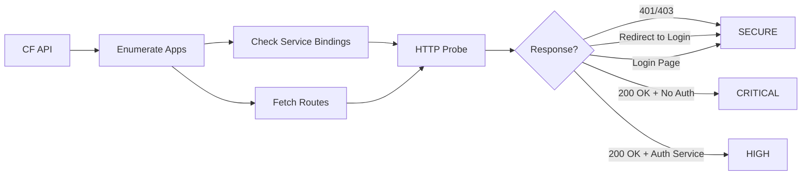

# CF Auth Scanner


A security tool that scans Cloud Foundry applications to identify web interfaces without authentication protection.

## Overview

CF Auth Scanner helps platform operators and security teams find potentially exposed applications by:

1. **Enumerating** all apps across selected Orgs and Spaces
2. **Analyzing** service bindings to detect authentication services (SSO, UAA, OIDC, etc.)
3. **Probing** each app's public URL to verify authentication is enforced
4. **Reporting** findings with risk classifications and clickable links



## Prerequisites

- **Python 3.8+**
- **Cloud Foundry CLI** (`cf`) installed and logged in
- Network access to CF API and application routes

## Installation

```bash
# Clone the repository
git clone https://github.com/dbbaskette/cf-auth-scanner.git
cd cf-auth-scanner

# Run with auto-setup (creates venv and installs dependencies)
./run.sh
```

Or install manually:

```bash
python3 -m venv venv
source venv/bin/activate
pip install -r requirements.txt
```

## Usage

### Quick Start

```bash
# Login to Cloud Foundry first
cf login -a https://api.your-cf.com

# Run the scanner (interactive mode)
./run.sh
```

### Scan Modes

| Mode | Command | Description |
|------|---------|-------------|
| **Interactive** | `./run.sh` | Select Orgs/Spaces from a menu |
| **Current Target** | `./run.sh --scope current` | Scan your current `cf target` |
| **Config File** | `./run.sh --scope config` | Scan targets defined in YAML |

### Command Line Options

```bash
./run.sh [OPTIONS]

Options:
  --scope [interactive|config|current]  Scope selection mode (default: interactive)
  --config PATH                         Path to config file (default: scan_config.yaml)
  --output PATH                         Save JSON report to file
  --help                                Show help message
```

### Examples

```bash
# Scan current org/space only
./run.sh --scope current

# Use custom config and save report
./run.sh --scope config --config my-targets.yaml --output report.json

# Interactive mode with JSON output
./run.sh --output scan-results.json
```

## Risk Classifications

| Status | Description | Action Required |
|--------|-------------|-----------------|
| **CRITICAL** | No auth service bound, returns 200 OK | Immediate review - likely exposed |
| **HIGH** | Auth service bound but returns 200 OK | Review - possible misconfiguration |
| **WARNING** | Unexpected redirect or response | Manual verification needed |
| **SECURE** | Returns 401/403 or redirects to login | No action needed |
| **SKIPPED** | App stopped or has no routes | N/A |
| **UNREACHABLE** | Connection failed | Check network/app health |

## Configuration

Edit `scan_config.yaml` to customize scanning:

```yaml
# Target specific orgs and spaces
targets:
  - org: "production-org"
    spaces: ["web-apps", "api-services"]
  - org: "staging-org"
    spaces: ["*"]  # All spaces in org

# Keywords to identify auth services
auth_service_keywords:
  - "uaa"
  - "sso"
  - "oauth"
  - "oidc"
  - "keycloak"
  - "okta"
  - "pingfederate"

# Performance settings
settings:
  timeout_seconds: 5    # HTTP probe timeout
  max_threads: 10       # Parallel workers
```

## Sample Output

```
                         Scan Results
╭──────────┬─────────┬──────────────┬──────────┬─────────────────────╮
│ Org      │ Space   │ App          │ Status   │ Details             │
├──────────┼─────────┼──────────────┼──────────┼─────────────────────┤
│ prod     │ web     │ admin-panel  │ CRITICAL │ OPEN WEB INTERFACE  │
│ prod     │ web     │ public-api   │ HIGH     │ Auth service bound… │
│ prod     │ api     │ user-service │ SECURE   │ Redirects to login  │
│ staging  │ dev     │ test-app     │ SKIPPED  │ App is STOPPED      │
╰──────────┴─────────┴──────────────┴──────────┴─────────────────────╯
```

App names are clickable links in supported terminals (iTerm2, Windows Terminal, etc.).

## How It Works

### Detection Methods

1. **Service Binding Analysis**
   - Checks if apps are bound to known auth services
   - Configurable keyword matching

2. **HTTP Response Analysis**
   - `401 Unauthorized` / `403 Forbidden` → SECURE
   - `302 Redirect` to login URL → SECURE
   - `200 OK` with login form indicators → SECURE
   - `200 OK` without auth indicators → CRITICAL/HIGH

3. **Login Page Detection**
   - Password input fields
   - Common auth keywords (OIDC, OAuth, SSO, etc.)
   - Identity provider references

## Contributing

Contributions are welcome! Please feel free to submit issues and pull requests.

1. Fork the repository
2. Create a feature branch (`git checkout -b feature/improvement`)
3. Commit your changes (`git commit -am 'Add new feature'`)
4. Push to the branch (`git push origin feature/improvement`)
5. Open a Pull Request

## License

Distributed under the MIT License. See [LICENSE](LICENSE) for details.

## Acknowledgments

- Built for [Cloud Foundry](https://www.cloudfoundry.org/) / [Tanzu Application Service](https://tanzu.vmware.com/application-service)
- Uses [Rich](https://github.com/Textualize/rich) for terminal formatting
- Uses [Click](https://click.palletsprojects.com/) for CLI interface
